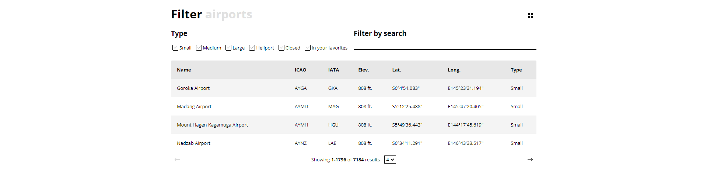
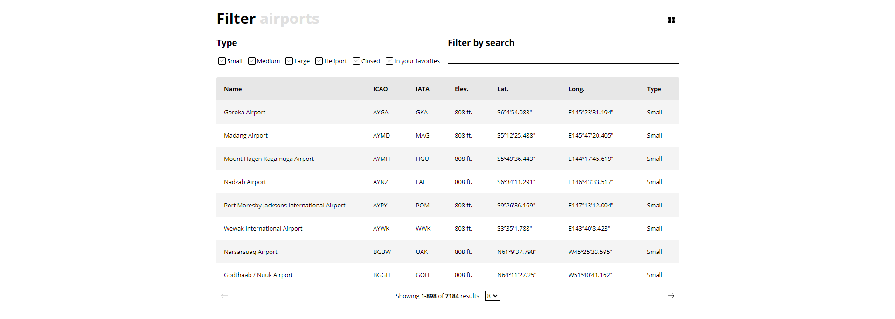
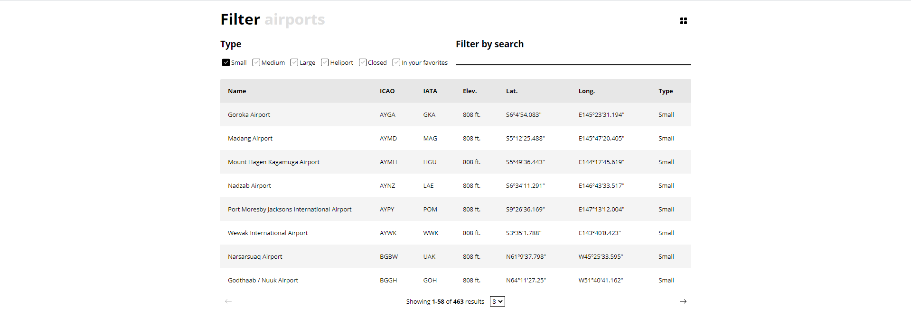
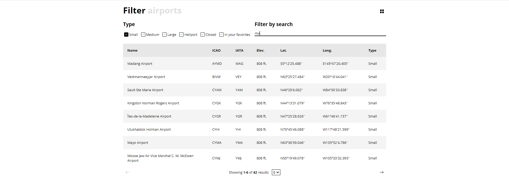
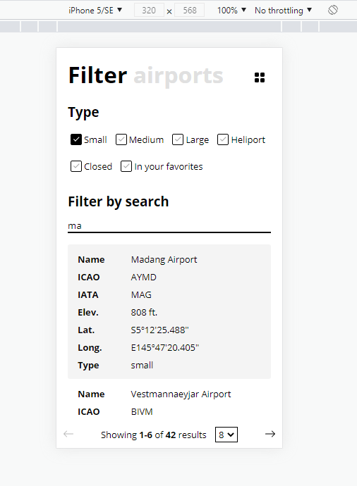

# Filter airports

Pure HTML, CSS, JavaScript application.

**Steps to run**
1. Open VSCode
2. Install Live Server extension
3. Go to index.html
4. Right click and click on "Open with Live Server".

**Features**

1. Caching layer between data fetch using Caching API.
2. Persistent filters and pagination current state that allow preselect the filters and pagination on page refresh.
3. Responsive.
4. Table filtering.
5. Pagination.
6. Change page size.

**Screenshots**

1. On large screen

2. Page size change

3. Filter based on type

4. Filter based on type and search

5. Mobile responsive

